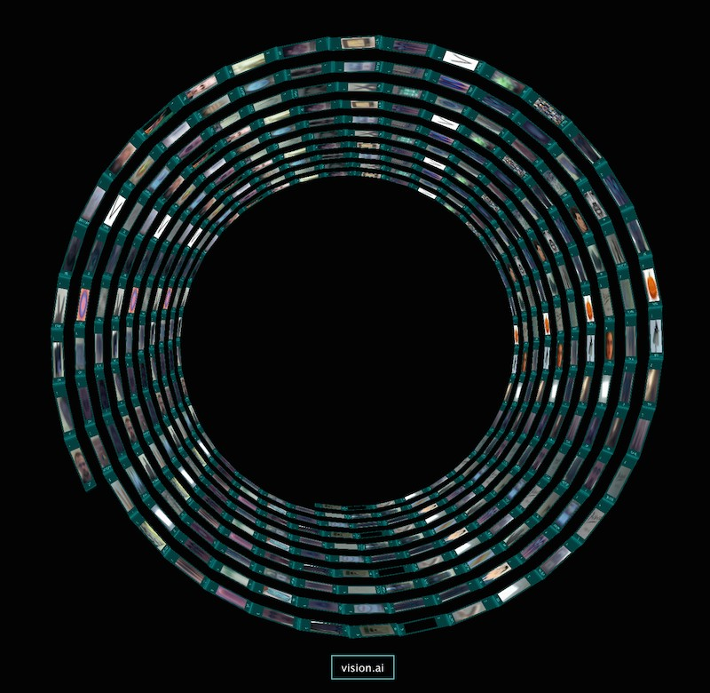

vmx-helix
=========

A javascript 3D visualization of the VMX model library.

Inspired by Mr. Doob's work.

[View Helix](http://htmlpreview.github.io/?https://github.com/VISIONAI/vmx-helix/blob/master/index.html)

[Original Threejs effect](http://threejs.org/examples/css3d_periodictable.html)
